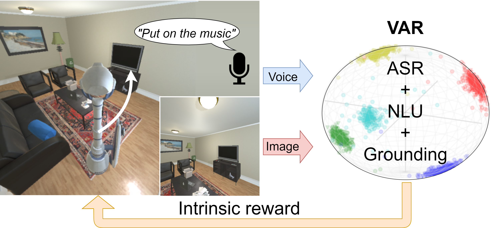

# VoiceControlledRobot-VAR
This repository contains the codes for our paper titled "Learning Visual-Audio Representations for Voice-Controlled Robots" in ICRA 2023. 
For more details, please refer to the [project website](https://sites.google.com/site/changpeixin/home/Research/learning-visual-audio-representations-for-voice-controlled-robots) and 
[arXiv preprint](https://arxiv.org/abs/2109.02823).
For experiment demonstrations, please refer to the [youtube video](https://www.youtube.com/watch?v=T83uUzSJpN4).

## Abstract
Based on the recent advancements in representation learning, 
we propose a novel pipeline for task-oriented voice-controlled robots with raw sensor inputs.
Previous methods rely on a large number of labels and task-specific reward functions. 
Not only can such an approach hardly be improved after the deployment, 
but also has limited generalization across robotic platforms and tasks. 
To address these problems, our pipeline first learns a visual-audio representation (VAR) 
that associates images and sound commands. 
Then the robot learns to fulfill the sound command via reinforcement learning using the reward generated by the VAR. 
We demonstrate our approach with various sound types, robots, and tasks. 
We show that our method outperforms previous work with much fewer labels. 
We show in both the simulated and real-world experiments that the system can self-improve in previously unseen scenarios given a reasonable number of newly labeled data.
<p align="center">

</p>

## Setup
1. Install the python packages in `requirements.txt`
2. The package `sounddevice` requires additional package install `sudo apt-get install libportaudio2`
3. We use the following sound dataset: [Fluent Speech Dataset](https://fluent.ai/fluent-speech-commands-a-dataset-for-spoken-language-understanding-research/), [GoogleCommand Dataset](https://ai.googleblog.com/2017/08/launching-speech-commands-dataset.html), [NSynth](https://magenta.tensorflow.org/datasets/nsynth), and [UrbanSound8K](https://urbansounddataset.weebly.com/urbansound8k.html).
The sound data is located under `commonMedia` folder. Notice that we processed the sound data to be mono wav with 16kHz sampling rate.

## Getting started
### Structure
- commonMedia: contains sound datasets
- data: contains the data collected from the environment, VAR models, and the RL models.
- Envs: contains the implementation of OpenAI Gym environments used in the paper. The Kuka environment is in Envs/pybullet. The iTHOR environment is in Envs/ai2thor. Each environment has a configuration file for the environment, the algorithm, and the deep model. 
- examples: contains important information about configuration
- models: contains the implementation of the VAR, the RL model, and an RL algorithm.
- VAR: contains functions which support pretext.py and RL.py
- cfg.py: Change this file to select one of the four environments to run. 
- dataset.py: definition of the dataset and data loader.
- pretext.py: run this file to collect triplets, train, and test the VAR.
- RL.py: run this file to load the trained VAR and perform the RL training, testing and fine-tuning.
- utils.py: contains some helper functions 
 
### Run the code
0. Correctly set the configuration file. Please see the [README.md](examples/README.md) in `examples`
1. VAR related: 
```
python pretext.py 
```

2. RL related:
```
python RL.py 
```

## Citation
If you find the code or the paper useful for your research, please cite our paper:
```
@INPROCEEDINGS{chang2023learning,
  author={Chang, Peixin and Liu, Shuijing and McPherson, D. Livingston and Driggs-Campbell, Katherine},
  booktitle={IEEE International Conference on Robotics and Automation (ICRA)}, 
  title={Learning Visual-Audio Representations for Voice-Controlled Robots}, 
  year={2023},
  volume={},
  number={},
  pages={9508-9514},
  doi={10.1109/ICRA48891.2023.10161461}}
```

## Credits
Other contributors:  
[Shuijing Liu](https://github.com/Shuijing725)

Part of the code is based on the following repositories:

[1] I. Kostrikov, “Pytorch implementations of reinforcement learning algorithms,” https://github.com/ikostrikov/pytorch-a2c-ppo-acktr-gail, 2018.

## Contact
If you have any questions or find any bugs, please feel free to open an issue or pull request.
